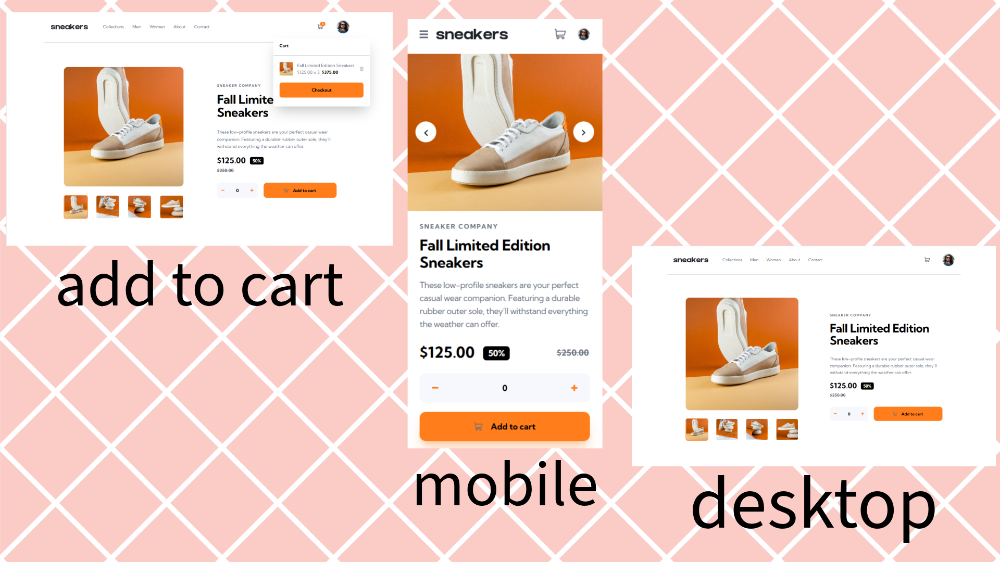

# Frontend Mentor - E-commerce product page solution

This is a solution to the [E-commerce product page challenge on Frontend Mentor](https://www.frontendmentor.io/challenges/ecommerce-product-page-UPsZ9MJp6).

## Table of contents

- [Overview](#overview)
  - [The challenge](#the-challenge)
  - [Screenshot](#screenshot)
  - [Links](#links)
- [My process](#my-process)
  - [Built with](#built-with)
- [Author](#author)

## Overview

### The challenge

Users should be able to:

- View the optimal layout for the site depending on their device's screen size
- See hover states for all interactive elements on the page
- Open a lightbox gallery by clicking on the large product image
- Switch the large product image by clicking on the small thumbnail images
- Add items to the cart
- View the cart and remove items from it

### Screenshot

### Links

- Solution URL: [Click Here](https://github.com/wang-yin/FrontendMentor/tree/main/Intermediate/ecommerce-product-page-main)
- Live Site URL: [Click Here](https://yinecommerce-product-page.netlify.app/)

## My process

### Built with

- [React](https://react.dev/) - JavaScript library for building user interfaces.
- CSS3 - Traditional CSS for global styles and layout.
- Mobile-first workflow - Responsive design from small screens to large screens.
- Flexbox & Grid - Modern CSS layout techniques.
- [Vite](https://vitejs.dev/) - Fast frontend tooling for development.
- Git - Version control system.
- GitHub - Code hosting and collaboration.
- [Netlify](https://www.netlify.com/) - Static site deployment and hosting.

## Author

- [Wang-yin](https://github.com/wang-yin)
