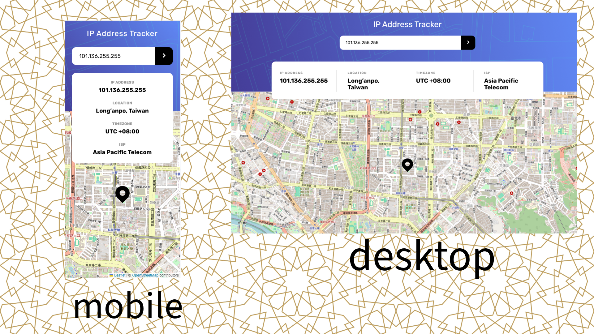

# Frontend Mentor - IP address tracker solution

This is a solution to the [IP address tracker challenge on Frontend Mentor](https://www.frontendmentor.io/challenges/ip-address-tracker-I8-0yYAH0).

## Table of contents

- [Overview](#overview)
  - [The challenge](#the-challenge)
  - [Screenshot](#screenshot)
  - [Links](#links)
- [My process](#my-process)
  - [Built with](#built-with)
- [Author](#author)

## Overview

### The challenge

Users should be able to:

- View the optimal layout for each page depending on their device's screen size
- See hover states for all interactive elements on the page
- See their own IP address on the map on the initial page load
- Search for any IP addresses or domains and see the key information and location

### Screenshot

### Links

- Solution URL: [Click Here](https://github.com/wang-yin/FrontendMentor/tree/main/Intermediate/ip-address-tracker-master)
- Live Site URL: [Click Here](https://yinip-address-tracker.netlify.app/)

## My process

### Built with

- [React](https://react.dev/) - JavaScript library for building user interfaces.
- [React-Leaflet](https://react-leaflet.js.org/) - Interactive maps with OpenStreetMap integration.
- [Axios](https://axios-http.com/) - Promise-based HTTP client for API requests.
- [IP Geolocation API by IPify](https://geo.ipify.org/) - Real-time user location detection by IP address.
- CSS3 - Traditional CSS for global styles and layout.
- Mobile-first workflow - Responsive design from small screens to large screens.
- Flexbox & Grid - Modern CSS layout techniques.
- [Vite](https://vitejs.dev/) - Fast frontend tooling for development.
- Git - Version control system.
- GitHub - Code hosting and collaboration.
- [Netlify](https://www.netlify.com/) - Static site deployment and hosting.

## Author

- [Wang-yin](https://github.com/wang-yin)
