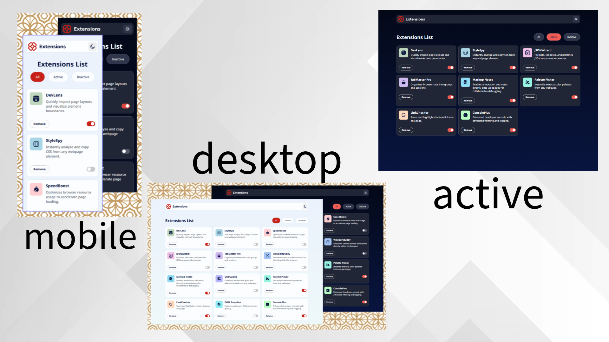

# Frontend Mentor - Browser extensions manager UI solution

This is a solution to the [Browser extensions manager UI challenge on Frontend Mentor](https://www.frontendmentor.io/challenges/browser-extension-manager-ui-yNZnOfsMAp).

## Table of contents

- [Overview](#overview)
  - [The challenge](#the-challenge)
  - [Screenshot](#screenshot)
  - [Links](#links)
- [My process](#my-process)
  - [Built with](#built-with)
- [Author](#author)

## Overview

### The challenge

Users should be able to:

- Toggle extensions between active and inactive states
- Filter active and inactive extensions
- Remove extensions from the list
- Select their color theme
- View the optimal layout for the interface depending on their device's screen size
- See hover and focus states for all interactive elements on the page

### Screenshot

### Links

- Solution URL: [Click Here](https://github.com/wang-yin/FrontendMentor/tree/main/Junior/browser-extensions-manager-ui-main)
- Live Site URL: [Click Here](https://yinbrowser-extensions-manager-ui.netlify.app/)

## My process

### Built with

- React - JavaScript library for building user interfaces.
- CSS3 - Traditional CSS for global styles and layout.
- Mobile-first workflow - Responsive design from small screens to large screens.
- Flexbox & Grid - Modern CSS layout techniques for flexible UIs.
- Vite - Module bundler and development tools.
- Git - Version control system.
- GitHub - For code hosting and version control.
- Netlify - For project deployment and static site hosting.

## Author

- [Wang-yin](https://github.com/wang-yin)
