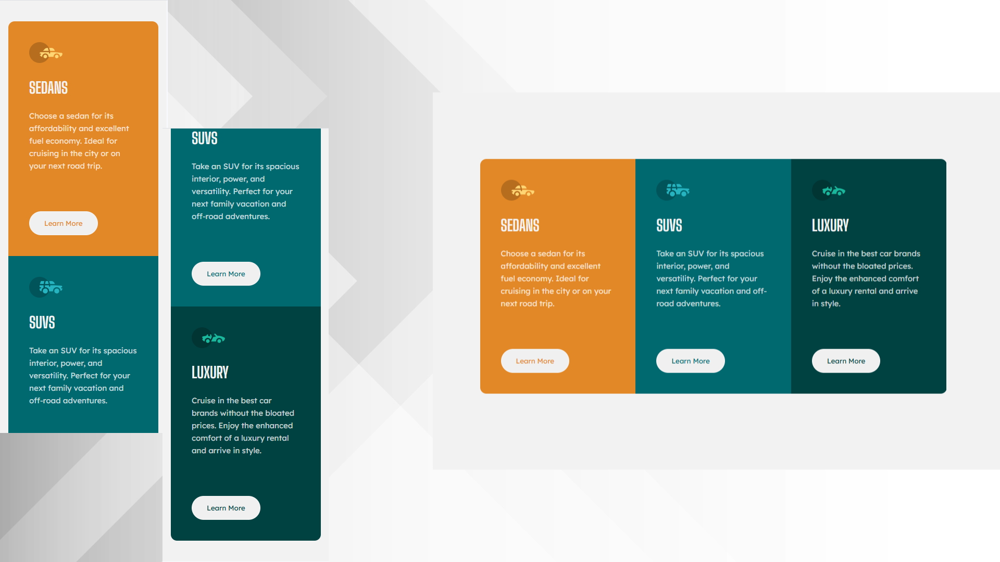

# Frontend Mentor - 3-column preview card component solution

This is a solution to the [3-column preview card component challenge on Frontend Mentor](https://www.frontendmentor.io/challenges/3column-preview-card-component-pH92eAR2-).

## Table of contents

- [Overview](#overview)
  - [The challenge](#the-challenge)
  - [Screenshot](#screenshot)
  - [Links](#links)
- [My process](#my-process)
  - [Built with](#built-with)
- [Author](#author)

## Overview

### The challenge

Users should be able to:

- View the optimal layout depending on their device's screen size
- See hover states for interactive elements

### Screenshot

### Links

- Live Site URL: [Netlify]()

## My process

### Built with

- React - JavaScript library for building user interfaces.
- Styled-components - CSS-in-JS solution for component-based styling.
- CSS3 - Traditional CSS for global styles and layout.
- Desktop-first workflow - Responsive design from large screens to small screens.
- Flexbox & Grid - Modern CSS layout techniques for flexible UIs.
- JavaScript (ES6+) - For dynamic functionality and logic.
- Vite - Module bundler and development tools.
- Git - Version control system.
- GitHub - For code hosting and version control.
- Netlify - For project deployment and static site hosting.

## Author

[Wang-yin](https://github.com/wang-yin)
