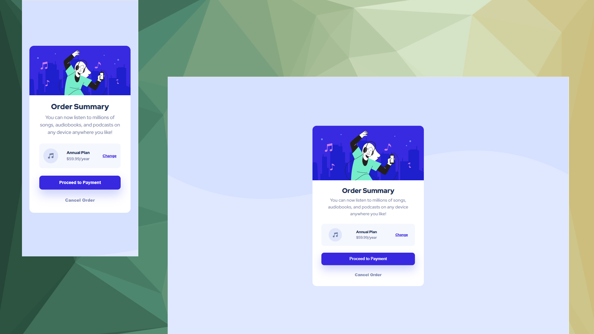

# Frontend Mentor - Order summary card solution

This is a solution to the [Order summary card challenge on Frontend Mentor](https://www.frontendmentor.io/challenges/order-summary-component-QlPmajDUj).

## Table of contents

- [Overview](#overview)
  - [The challenge](#the-challenge)
  - [Screenshot](#screenshot)
  - [Links](#links)
- [My process](#my-process)
  - [Built with](#built-with)
  - [Continued development](#continued-development)
- [Author](#author)

## Overview

### The challenge

Users should be able to:

- See hover states for interactive elements
- View the optimal layout depending on their device's screen size

### Screenshot

### Links

- Solution URL: [Click Here](https://github.com/wang-yin/FrontendMentor/tree/main/Newbie/order-summary-component-main)
- Live Site URL: [Click Here](https://yinorder-summary-component.netlify.app/)

## My process

### Built with

- React - JavaScript library for building user interfaces.
- CSS3 - Traditional CSS for global styles and layout.
- Mobile-first workflow - Responsive design from small screens to large screens.
- Flexbox - Modern CSS layout techniques for flexible UIs.
- JavaScript (ES6+) - For dynamic functionality and logic.
- Vite - Module bundler and development tools.
- Git - Version control system.
- GitHub - For code hosting and version control.
- Netlify - For project deployment and static site hosting.

### Continued development

- Animations can be added in the future to make the hover state smoother.

- Dynamic effects after clicking a button can be implemented, such as displaying a loading state or redirecting to another page.

## Author

- [Wang-yin](https://github.com/wang-yin)
